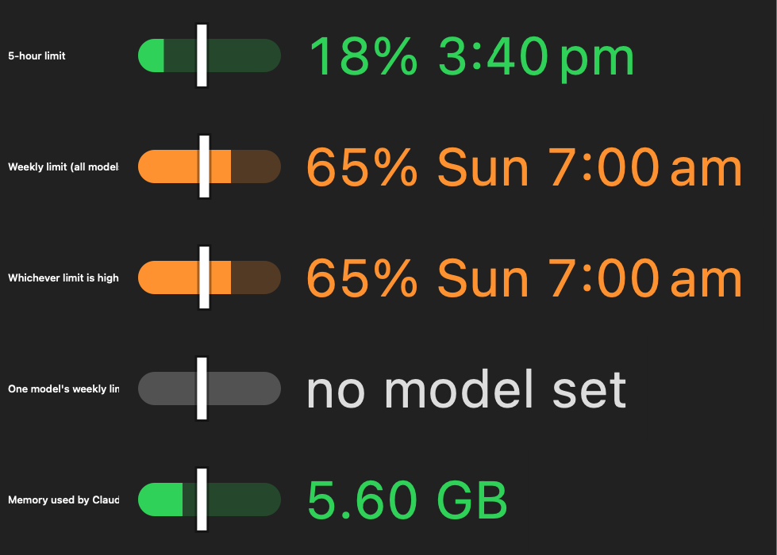

<p align="center">
  
</p>

<h1 align="center">Torpor</h1>

<p align="center">
  A macOS menu bar app for Claude Code sessions. See what each one actually costs
  in memory, and put the idle ones to sleep without losing them.
</p>

<p align="center">
  <a href="https://github.com/YasserShkeir/torpor/stargazers">Star</a> ·
  <a href="https://github.com/YasserShkeir/torpor/issues/new/choose">Report a bug</a> ·
  <a href="https://github.com/YasserShkeir/torpor/discussions">Discussions</a> ·
  <a href="https://github.com/YasserShkeir/torpor/releases/latest">Releases</a>
</p>

<p align="center">
  <a href="https://github.com/YasserShkeir/torpor/actions/workflows/ci.yml"></a>
  <a href="https://github.com/YasserShkeir/torpor/releases/latest"></a>
  
</p>

<p align="center">
  
</p>

---

I had twelve sessions open across six repos and six of them hadn't been touched
in days. My Mac was swapping. Activity Monitor wasn't much help, because most of
the memory isn't in the `claude` process at all. It's in the MCP servers hanging
off it, and those show up as unrelated rows.

So I wrote this.

## What it does

Lists every running session grouped by folder, with status, idle time, and total
memory including its MCP subtree. Three sessions in one repo read as one project
with two working and one idle, not three unrelated rows.

Then two things you can do to a session.

**Freeze** stops it and everything under it. CPU drops to zero. Unfreeze and it
carries on from where it stopped.

**Hibernate** ends an idle session and gives you all its memory back. One click
brings it back later, in the same terminal tab, at the same directory, with the
flags it was started with. You never type `--resume`.

There's also your 5-hour and weekly Claude usage in the menu bar, with a white
marker showing how far through the window you are. Fill short of the marker means
you're inside the pace the window can carry.

## Install

```sh
brew install --cask yassershkeir/torpor/torpor
```

Then, **before you open it the first time**:

```sh
xattr -dr com.apple.quarantine /Applications/Torpor.app
```

That command is explained in [Why macOS blocks it](#why-macos-blocks-it). If
you've already tried to open Torpor it won't work, and you want the *Open Anyway*
route in that section instead.

Or take the zip from [the latest release](https://github.com/YasserShkeir/torpor/releases/latest),
drag it to Applications, and run the same command before opening it.

Or build it, which skips the Gatekeeper business entirely, because software you
compiled yourself was never quarantined:

```sh
git clone https://github.com/YasserShkeir/torpor.git
cd torpor && ./scripts/build-app.sh && open dist/Torpor.app
```

Needs macOS 14 or later, and Swift 6.2 to build.

## Why macOS blocks it

Torpor is ad-hoc signed and not notarised. Notarising means an Apple Developer
Program membership at $99 a year, which this project doesn't have yet. macOS
marks anything downloaded from the internet as quarantined and won't open
quarantined software Apple hasn't checked. Nothing's wrong with the download. It
just can't tell who built it.

If you haven't opened it yet, drop the marker:

```sh
xattr -dr com.apple.quarantine /Applications/Torpor.app
```

That's a command you should be a bit suspicious of when a stranger hands it to
you, which is why building from source sits right above it.

If you already double-clicked and got the warning, that command now fails with
`Operation not permitted`, because macOS locks the marker once it's blocked a
launch. Go to **System Settings → Privacy & Security**, scroll to **Security**,
and click **Open Anyway**. Do it soon, the entry doesn't hang around.

The first time you revive a session, macOS asks permission to control Terminal or
iTerm. That's how it reopens the session in the tab it was already in. It asks
again after every update, because each ad-hoc build looks like a different app to
macOS. A Developer ID fixes that, and it's the main reason this project will
eventually buy one.

## Freezing doesn't free memory, and I shipped it saying so

I assumed it would. Seemed obvious. Then I measured eight idle sessions before
release:

| | footprint | still in physical RAM |
|---|---|---|
| 8 idle sessions | 2,797 MB | 344 MB |

macOS had already compressed and paged out the rest. Nothing in the kernel's
reclaim path checks whether a process is stopped, so a perfect freeze gets you
that 344 MB at best. Hibernating gives back the whole 2,797 MB, including what's
sitting in swap.

So Freeze is a CPU control here, not a memory one. Useful against a session
that's spinning, and that's what the app calls it.

Related: Torpor reports `phys_footprint`, not RSS. RSS leaves out compressed
pages, and one idle session measured 24 MB by RSS against 319 MB by footprint.
Any RSS-based monitor is wrong about idle processes by roughly ten times, which
was the whole reason for writing this.

## Where the usage numbers come from

Four sources, and they're not equivalent.

| Source | Gives you | Standing |
|---|---|---|
| **Claude Code statusline** (default) | 5-hour and weekly percentages, reset times | Documented. No credentials, no network calls. |
| **Console API key** | Month-to-date spend, daily cost, per-model breakdown | Anthropic's documented path. Needs an org account. |
| **Connect with Claude CLI** | Plan usage, model-scoped limits, credits | Can get your account banned |
| **Paste subscription token** | Same as above | Can get your account banned |

The default reads a payload Claude Code already hands your statusline. Torpor
installs a small script that saves those numbers and then runs whatever
statusline you had, so your prompt looks the same as before.

The two token options reuse the OAuth credential Claude Code keeps for itself and
call an endpoint Anthropic doesn't document, sending a `claude-code/<version>`
User-Agent copied from your installed CLI. In January 2026 Anthropic deployed
anti-spoofing safeguards and banned accounts for that traffic. Torpor can do it,
because some people want the model-scoped rows badly enough, but it stays inert
until you pick it and tick a box saying what the risk is. That risk lands on your
account, not mine.

## Updating

Torpor updates itself. Checks once a day, tells you, installs when you say so.
There's a button in Settings if you'd rather not wait.

Updates carry a signature checked against a key built into the app. macOS can't
vouch for Torpor, so Torpor vouches for its own updates.

## Uninstalling

Run this first. It puts back whatever statusline you had before, and nothing else
can once the app is gone.

```sh
/Applications/Torpor.app/Contents/MacOS/Torpor --uninstall-statusline
brew uninstall --zap --cask torpor
```

## Notes for anyone reading the code

Things that cost me time, in case they save you some.

**Don't find sessions by process name.** The executable's filename is the Claude
Code version string, so `pgrep -x claude` matched one of my twelve sessions.
`~/.claude/sessions/<pid>.json` is the only reliable list, and every field in it
gets read as optional, because none of it is documented.

**`claude --resume` is lossy.** It restores the conversation but drops
`--mcp-config`, `--settings`, `--plugin-dir`, `--add-dir` and `--model`. Torpor
reads the process's argv before killing it and replays those, which makes its
resume more faithful than typing the command yourself. The replay list is an
allowlist rather than a passthrough. Feed back `--output-format stream-json` and
you get a session reading JSON from the keyboard.

**Transcript token counts need three rules.** Dedupe on `(message.id, requestId)`
keeping the largest snapshot, because streaming rewrites a message repeatedly with
growing counts. Skip `subagents/*.jsonl`, which on my machine was 3,329 of 3,490
files. Classify by each record's own `message.model`.

**Reviving into the original tab works** because killing `claude` leaves its
parent shell alive, so the tab is still sitting at a prompt. Torpor records the
controlling tty and matches it against open Terminal and iTerm tabs. VS Code's
built-in terminal has no scripting API, so those sessions get a new window.

There's a CLI too, which is how most of this got debugged:

```
Torpor --list          sessions with memory
Torpor --groups        grouped by folder
Torpor --preview <pid> what hibernate would capture, no side effects
Torpor --render-live   render the exact menu bar item, magnified
```

## Contributing

Bug reports are the useful thing. Torpor reads Claude Code internals that aren't
documented and Claude Code ships around six releases a week, so it will break and
I often won't have noticed. Include `Torpor --list`, `Torpor --status` and your
Claude Code version. More in [CONTRIBUTING.md](CONTRIBUTING.md).

One hard rule for pull requests: no code path reads a subscription token or
contacts that endpoint without an explicit opt-in from the user.

No telemetry, no analytics, no crash reporting, and there won't be any. Torpor
parses your conversation transcripts to count tokens, and those hold source code
and whatever you've pasted into a prompt. A crash reporter would sweep that into
breadcrumbs.

## License

MIT. See [LICENSE](LICENSE).

---

<p align="center">
  Built by <strong>Yasser Shkeir</strong><br>
  <a href="https://yasser-shkeir.com">yasser-shkeir.com</a> ·
  <a href="https://github.com/YasserShkeir">GitHub</a> ·
  <a href="https://www.linkedin.com/in/yasser-shkeir">LinkedIn</a>
</p>

<p align="center">
  <sub>Not affiliated with Anthropic. "Claude" is a trademark of Anthropic PBC.</sub>
</p>
