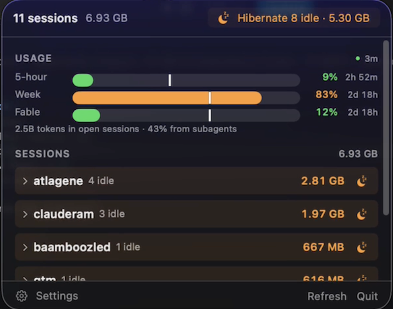
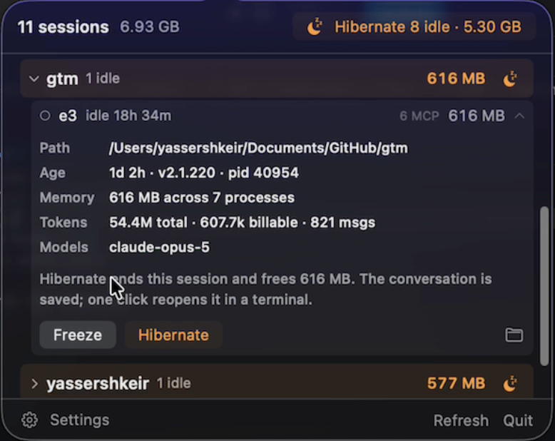
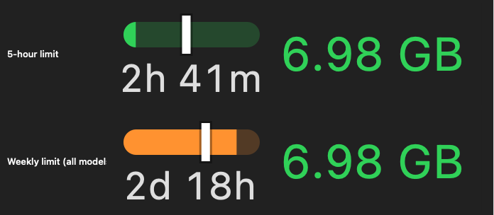
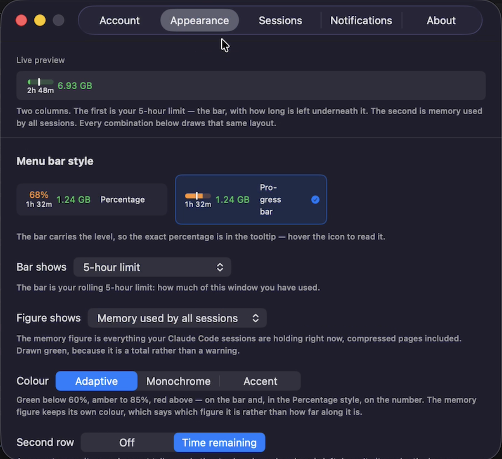

<p align="center">
  
</p>

<h1 align="center">Torpor</h1>

<p align="center">
  A macOS menu bar app for Claude Code sessions. See what each one actually costs
  in memory, and put the idle ones to sleep without losing them.
</p>

<p align="center">
  <a href="https://github.com/YasserShkeir/torpor/stargazers">Star</a> ·
  <a href="https://github.com/YasserShkeir/torpor/issues/new/choose">Report a bug</a> ·
  <a href="https://github.com/YasserShkeir/torpor/discussions">Discussions</a> ·
  <a href="https://github.com/YasserShkeir/torpor/releases/latest">Releases</a>
</p>

<p align="center">
  <a href="https://github.com/YasserShkeir/torpor/actions/workflows/ci.yml"></a>
  <a href="https://github.com/YasserShkeir/torpor/releases/latest"></a>
  
</p>

<p align="center">
  
</p>

---

I had twelve sessions open across six repos and six hadn't been touched in days.
My Mac was swapping. Activity Monitor wasn't much help, because most of the memory
isn't in the `claude` process at all. It's in the MCP servers hanging off it, and
those show up as unrelated `node` rows.

## What it does

Sessions grouped by folder, with the real memory of each one including its MCP
subtree. Then two things you can do to a session.

<p align="center">
  
</p>

**Freeze** stops it and everything under it. CPU drops to zero. Unfreeze and it
carries on.

**Hibernate** ends an idle session and gives you all its memory back. One click
brings it back later, in the same terminal tab, at the same directory, with the
flags it was started with. You never type `--resume`.

Your 5-hour and weekly usage sit in the menu bar, with a white line marking how
far through the window you are. Fill behind the line means you're inside the pace
the window can carry.

<p align="center">
  
</p>

## Install

```sh
brew install --cask yassershkeir/torpor/torpor
```

Then, **before you open it the first time**:

```sh
xattr -dr com.apple.quarantine /Applications/Torpor.app
```

Torpor is ad-hoc signed and not notarised, so macOS won't open it until that
marker is gone. If you already double-clicked and got the warning, that command
fails and you want **System Settings → Privacy & Security → Open Anyway** instead.

Building it yourself skips all of that, because software you compiled was never
quarantined:

```sh
git clone https://github.com/YasserShkeir/torpor.git
cd torpor && ./scripts/build-app.sh && open dist/Torpor.app
```

Needs macOS 14 or later, and Swift 6.2 to build.

The first revive asks permission to control Terminal or iTerm, and asks again
after every update, because each ad-hoc build looks like a different app. An Apple
Developer ID fixes that. The application is in and I'm waiting on Apple.

## Freezing doesn't free memory, and I shipped it saying so

I assumed it would. Then I measured eight idle sessions before release:

| | footprint | still in physical RAM |
|---|---|---|
| 8 idle sessions | 2,797 MB | 344 MB |

macOS had already compressed and paged out the rest, and nothing in the kernel's
reclaim path checks whether a process is stopped. So a perfect freeze gets you
that 344 MB at best. Hibernating gives back the whole 2,797 MB, swap included.

Freeze is a CPU control here, not a memory one, and that's what the app calls it.

Related: Torpor reports `phys_footprint`, not RSS. RSS leaves out compressed
pages, and one idle session measured 24 MB by RSS against 319 MB by footprint.
Any RSS-based monitor is wrong about idle processes by roughly ten times, which
was the whole reason for writing this.

## Where the usage numbers come from

<p align="center">
  
</p>

| Source | Gives you | Standing |
|---|---|---|
| **Claude Code statusline** (default) | 5-hour and weekly windows, reset times, exact cost | Documented. No credentials, no network calls |
| **Console API key** | Month-to-date spend, daily cost, per-model breakdown | Anthropic's documented path. Needs an org account |
| **Connect with Claude CLI** | The above plus the per-model rows and credits | Undocumented endpoint, your credential |
| **Paste subscription token** | Same | Undocumented endpoint, your credential |

The default reads a payload Claude Code already hands your statusline, via a small
script that saves the fields Torpor needs and then runs whatever statusline you
had. Your prompt looks the same as before. That payload includes an exact cost
figure Claude Code has already computed, so Torpor prices nothing itself.

It carries no per-model limit, though, which is why there's no Fable or Opus bar
on the default source. Those rows come from your account, and only the two token
options reach them. They reuse the OAuth credential Claude Code keeps for itself,
against an endpoint Anthropic doesn't document, and stay inert until you pick one
and tick a box. Torpor identifies itself honestly when it does, having previously
copied Claude Code's User-Agent to look first-party, which bought nothing and was
the whole risk. It's still undocumented and Anthropic's terms still say OAuth is
for their own clients, so the box is still there. That risk is yours, not mine.

## Updating and uninstalling

Torpor updates itself, checking a static appcast once a day. Updates carry an
EdDSA signature checked against a key built into the app, which is what vouches
for them given macOS can't.

Run this **before** deleting the app. Nothing else can put your statusline back
once the binary is gone.

```sh
/Applications/Torpor.app/Contents/MacOS/Torpor --uninstall-statusline
brew uninstall --zap --cask torpor
```

## Docs

- **[CLI reference](docs/cli.md)** — the same binary is a command line tool, which
  is how most of this got debugged
- **[Notes on the internals](docs/internals.md)** — the undocumented Claude Code
  behaviour and the macOS memory accounting, measured rather than assumed

## Contributing

Bug reports are the useful thing. Torpor reads Claude Code internals that aren't
documented and Claude Code ships around six releases a week, so it will break and
I often won't have noticed. Include `Torpor --list`, `Torpor --status` and your
Claude Code version. More in [CONTRIBUTING.md](CONTRIBUTING.md).

One hard rule for pull requests: no code path reads a subscription token or
contacts that endpoint without an explicit opt-in from the user.

No telemetry, no analytics, no crash reporting, and there won't be any. Torpor
parses your transcripts to count tokens, and those hold source code and whatever
you've pasted into a prompt. A crash reporter would sweep that into breadcrumbs.

## License

MIT. See [LICENSE](LICENSE).

---

<p align="center">
  Built by <strong>Yasser Shkeir</strong><br>
  <a href="https://yasser-shkeir.com">yasser-shkeir.com</a> ·
  <a href="https://github.com/YasserShkeir">GitHub</a> ·
  <a href="https://www.linkedin.com/in/yasser-shkeir">LinkedIn</a>
</p>

<p align="center">
  <sub>Not affiliated with Anthropic. "Claude" is a trademark of Anthropic PBC.</sub>
</p>
